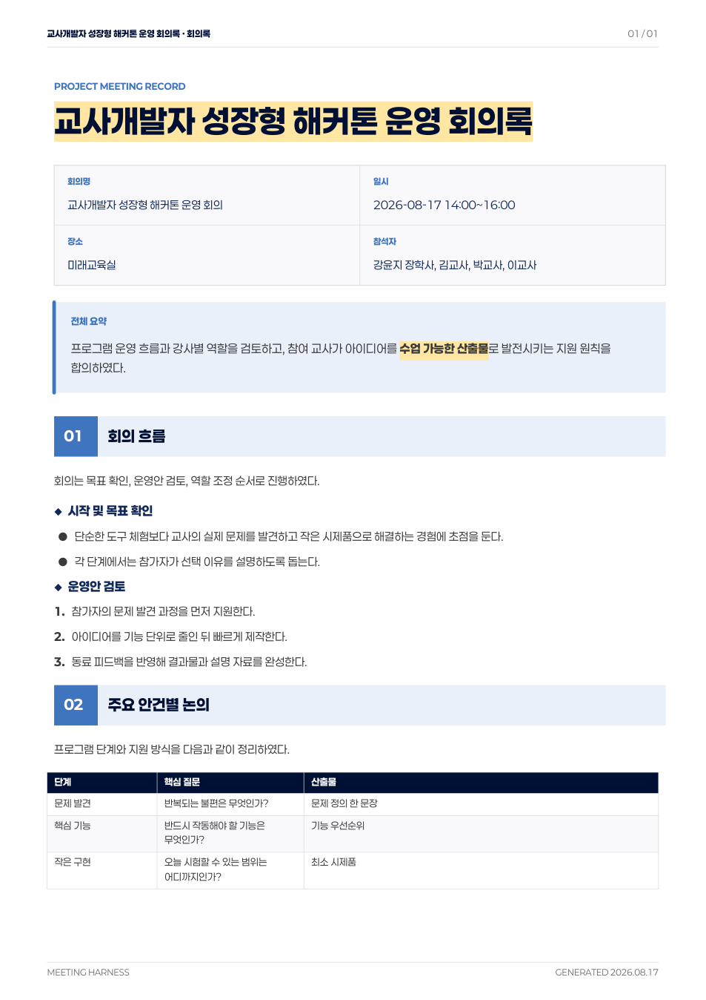

# meeting-harness

회의 녹화 파일이나 음성 파일을 넣으면 로컬 Whisper 전사, 회의록 Markdown 작성, DOCX/PDF 보고서 생성, 결과 검증까지 이어서 처리하는 CLI/skill 하네스입니다.



위 이미지는 실제 `meeting-harness` 렌더러가 만든 PDF입니다. 제목, 회의 정보, 전체 요약을 첫 페이지에서 확인하고 본문은 번호가 붙은 섹션과 표로 빠르게 찾아볼 수 있습니다.

## 무엇을 해주나요?

- 원본 영상/음성 파일은 복사하지 않고 처음 선택한 위치에서 참조합니다.
- 작업 폴더를 따로 만들고 그 안에서 처리합니다.
- 영상 파일이면 ffmpeg로 음성을 추출합니다.
- 여러 영상/음성 파일을 넣으면 순서대로 하나의 작업용 오디오로 합쳐 전사합니다.
- 로컬 faster-whisper로 전사합니다.
- Codex 또는 Claude가 회의 맥락을 정리할 수 있도록 작업 파일을 준비합니다.
- `meeting.md`를 기준으로 편집용 DOCX와 제출·공유용 A4 PDF 회의록을 만듭니다.
- PDF 첫 페이지에 제목, 회의 정보 카드, 전체 요약을 배치합니다.
- 본문에 번호형 섹션, 소제목, 목록, 표, 확인 필요 콜아웃을 적용합니다.
- 모든 PDF 페이지에 머리글·바닥글과 현재 쪽/전체 쪽수를 표시합니다.
- 구체적인 제목이 있으면 제목 기반 PDF를, 없으면 `meeting.pdf`를 한 개만 만듭니다.
- Paperlogy 폰트를 PDF에 임베딩해 Windows/macOS에서도 한글이 깨지지 않도록 합니다.
- 마지막에 결과물이 제대로 만들어졌는지 검증 보고서를 만듭니다.

## 설치 방법

Windows PowerShell에서 실행합니다.

```powershell
irm https://raw.githubusercontent.com/HooniKims/meeting_harness/main/scripts/install.ps1 | iex
```

macOS 또는 Linux 터미널에서 실행합니다.

```bash
curl -fsSL https://raw.githubusercontent.com/HooniKims/meeting_harness/main/scripts/install.sh | bash
```

설치 스크립트는 가능한 범위에서 다음 항목을 확인하고 설치를 도와줍니다.

- Node.js와 npm
- Python
- ffmpeg
- faster-whisper
- DOCX/PDF 생성에 필요한 Python 패키지
- `meeting-harness` CLI
- `meeting-harness` skill

이 프로젝트는 npm 패키지로 공개 배포하지 않습니다. npm은 `npx skills@latest`를 실행하기 위한 도구로만 사용합니다. 실제 CLI 설치는 GitHub ZIP installer가 처리합니다.

Python 패키지는 전역 Python에 설치하지 않습니다. installer는 하네스 전용 가상환경을 만들고 그 안에만 필요한 패키지를 설치합니다.

```text
~/.meeting-harness/venv
```

Windows에서는 다음 위치를 사용합니다.

```text
%USERPROFILE%\.meeting-harness\venv
```

PDF 한글 출력을 위해 Paperlogy 폰트가 프로젝트에 함께 포함됩니다. 별도로 폰트를 설치하지 않아도 GitHub ZIP 설치 시 같이 내려받아 PDF에 임베딩합니다.

설치 마지막에는 PC 사양을 확인해 전사 기본 설정을 저장합니다.

- 시스템 메모리
- CPU 코어 수
- NVIDIA GPU 및 VRAM, 감지 가능한 경우
- 사양 기반 추천 Whisper 모델
- 연산 설정

설정 파일은 다음 위치에 저장됩니다.

```text
~/.meeting-harness/config.json
```

Windows:

```text
%USERPROFILE%\.meeting-harness\config.json
```

기본 추천은 `auto`입니다. 고성능 NVIDIA GPU가 있으면 품질 쪽으로, GPU 없이 CPU로 전사하는 Mac mini M4나 일반 Windows PC에서는 균형 쪽으로 추천합니다.

```bash
meeting-harness setup --profile auto
meeting-harness setup --profile balanced
meeting-harness setup --profile quality
meeting-harness setup --profile fast
```

- `auto`: 사양을 보고 자동 추천
- `balanced`: 품질과 시간을 균형 있게 선택
- `quality`: 시간이 오래 걸려도 품질 우선
- `fast`: 긴 파일을 빠르게 처리하는 속도 우선

설치 후 새 터미널을 열고 확인합니다.

```bash
meeting-harness --help
```

## 기본 사용법

회의 영상 또는 음성 파일이 있는 폴더로 이동합니다.

```bash
cd path/to/meeting-folder
```

CLI로 직접 실행할 수 있습니다.

```bash
meeting-harness run meeting.mp4
```

특정 작업에만 균형 모드를 적용할 수도 있습니다.

```bash
meeting-harness run meeting.mp4 --profile balanced
```

`run`은 먼저 실행 환경을 점검합니다. Python, ffmpeg, Whisper 관련 패키지가 준비되지 않았으면 작업 폴더를 만들기 전에 멈추고 installer 재실행을 안내합니다. 그래서 환경 문제만으로 빈 작업 폴더가 계속 쌓이지 않도록 설계되어 있습니다.

같은 입력 파일로 실패하거나 진행 중인 작업 폴더가 이미 있으면 새 폴더를 만들지 않고 기존 작업 폴더를 재사용해 이어서 실행합니다. 정말 새 작업으로 다시 시작하고 싶을 때만 다음 옵션을 사용합니다.

```bash
meeting-harness run meeting.mp4 --new
```

여러 파일이면 순서대로 넣습니다.

```bash
meeting-harness run part1.mp4 part2.mp4 part3.mp4
```

여러 파일을 넣으면 명령에 전달한 원본 경로 순서대로 `work/audio.wav`를 만듭니다. 원본 자체를 작업 폴더에 복사하지 않으므로 음성 추출이 끝날 때까지 파일을 이동하거나 삭제하지 마세요. 기존 작업 폴더에 남아 있는 `input/original_*.ext` 복사본도 계속 사용할 수 있습니다. Windows에서 긴 웨비나나 연수 파일을 처리할 때는 전사 시작 로그의 전체 오디오 길이가 원본 길이 합계와 맞는지 확인하면 좋습니다.

폴더명이나 파일명에 공백, 한글, 괄호가 있어도 사용할 수 있어야 합니다. 예를 들어 Windows의 `video to audio` 같은 폴더에서도 동작하도록 설계되어 있습니다.

전사 단계는 오래 걸릴 수 있습니다. 실행 중에는 현재 처리 지점을 다음처럼 표시합니다.

```text
전사 시작: 전체 오디오 길이 01:12:34
전사 진행:  18.4% | 현재 00:13:22 / 전체 01:12:34 | 남은 음성 00:59:12 | 예상 남은 시간 27분 10초 | 구간 84개
전사 진행:  42.7% | 현재 00:30:59 / 전체 01:12:34 | 남은 음성 00:41:35 | 예상 남은 시간 18분 49초 | 구간 191개
```

Codex나 Claude에서 skill처럼 사용할 수도 있습니다.

```text
$meeting-harness 이 폴더의 회의 녹화 파일로 회의록 작성해줘.
$meeting-harness 음성 파일로 회의록 만들어줘.
$meeting-harness 실패한 부분부터 계속해줘.
$meeting-harness meeting.md 수정했으니 DOCX와 PDF 다시 만들어줘.
```

## 발화자/회의 정보 입력

회의 파일과 같은 폴더에 다음 파일 중 하나를 넣어두면 회의 맥락 보정에 활용합니다.

```text
meeting_info.txt
meeting_info.md
회의정보.txt
회의정보.md
speakers.txt
참석자.txt
```

예시:

```text
회의명: 2026학년도 교육과정 협의회
일시: 2026-05-21
참석자:
- 김OO: 교무부장
- 이OO: 연구부장
- 박OO: 3학년 담임

참고:
- 핵심 의견이 있을 때만 발화자 이름과 역할을 함께 표시한다.
- 회의록은 일반 보고서 형태로 정리한다.
```

발화자 정보는 전사 문장을 모두 이름표로 바꾸는 용도가 아닙니다. 회의 요약, 맥락 보정, 핵심 의견 attribution에만 사용합니다.

`참석자:`와 `주요 안건:`은 위 예시처럼 줄을 나누어 목록으로 적어도 읽을 수 있습니다. 한 줄로 적을 때는 쉼표나 세미콜론으로 구분합니다.

회의 정보 파일이 없거나 발화자 정보가 비어 있으면 CLI가 짧게 확인합니다. 다만 파일명이나 폴더명만으로 1인 강의/연수가 명백하면 질문으로 멈추지 않고 확인 메시지만 보여준 뒤 진행합니다.

```text
[회의 정보] 파일명/폴더명을 기준으로 1인 강의/연수로 보입니다.
[회의 정보] 자료 유형: 1인 강의/연수
[회의 정보] 발화자/참석자: 강의자: 미상
[회의 정보] 수정이 필요하면 meeting_info.txt를 추가하거나 --prompt 옵션으로 다시 실행하세요.
```

판단이 애매하면 다음처럼 직접 확인합니다.

```text
[회의 정보] 정보 파일을 찾지 못했습니다. 필요한 항목만 짧게 확인합니다.
자료 유형 [추천: 1인 강의/연수]:
제목/회의명 [추천: 교사연수_1]:
참석자/발화자 정보(쉼표 구분) [추천: 강의자: 미상]:
특이사항(없으면 Enter) [추천: 1인 강의/연수로 추정됨. 발화자 정보는 강의 맥락 보정에만 사용한다.]:
```

Codex/Claude가 비대화형으로 실행하는 경우에는 CLI가 직접 질문을 표시할 수 없습니다. 이때 회의 정보가 부족하고 1인 강의/연수로 명백히 추정되지 않으면 기본값으로 조용히 진행하지 않고 멈춥니다. 에이전트가 사용자에게 자료 유형과 참석자/발화자 정보를 확인한 뒤 `meeting_info.txt`를 만들고 다시 실행하는 흐름을 권장합니다.

명백한 1인 강의/연수이면 비대화형 환경에서도 확인 메시지만 보여주고 진행합니다. 기본값으로 강제 진행하려면 `--yes` 또는 `--no-prompt` 옵션을 명시적으로 사용합니다.

Windows PowerShell이나 Codex 비대화형 실행에서 정보 파일을 만들었는데도 회의 정보 부족 오류가 반복되면, 필요한 정보를 확인한 뒤 다음처럼 다시 실행할 수 있습니다.

```bash
meeting-harness run meeting.mp4 --profile balanced --no-prompt
```

이 경우 실행 후 `config/meeting_info.json`을 확인하세요. 제목이나 참석자가 파일명/기본값으로 들어갔다면 최종 `output/meeting.md`에는 사용자가 제공한 회의명, 일시, 참석자 정보를 우선 반영합니다.

## 결과물

작업이 끝나면 생성된 작업 폴더 안에서 다음 파일을 확인합니다.

```text
README_결과물.md
output/meeting.md
output/meeting.docx
output/<회의명 또는 연수명>.pdf 또는 output/meeting.pdf
output/verification_report.md
```

각 파일의 의미는 다음과 같습니다.

- `<회의명 또는 연수명>.pdf`: 구체적인 제목이 있을 때 만드는 최종 보고서
- `meeting.pdf`: 구체적인 제목이 없을 때만 사용하는 기본 이름의 최종 보고서
- `meeting.docx`: Word에서 수정 가능한 보고서
- `meeting.md`: 이후 수정의 기준이 되는 원본 회의록
- `verification_report.md`: 결과물 생성 상태를 확인한 검증 보고서
- `README_결과물.md`: 초보자를 위한 결과물 설명서

PDF는 위 두 이름 중 하나로만 생성됩니다. 다시 렌더링할 때 `output/`에 남아 있는 이전 PDF는 정리되며, Windows 파일명에 사용할 수 없는 문자는 자동으로 공백 처리됩니다.

### PDF와 DOCX의 차이

- 제목 기반 PDF 또는 `meeting.pdf`는 디자인이 적용된 최종본입니다. 제출하거나 공유할 때 사용합니다.
- `meeting.docx`는 Word에서 내용을 고치기 위한 편집본입니다.
- PDF와 DOCX는 목적이 다르므로 글꼴, 표, 여백, 페이지 구성이 완전히 같지 않을 수 있습니다.
- 내용을 수정할 때는 `meeting.md`를 기준으로 고친 뒤 PDF와 DOCX를 다시 생성하는 방식을 권장합니다.

## PDF 보고서 디자인

PDF는 별도 표지 없이 첫 페이지부터 회의 내용을 보여줍니다.

- 첫 페이지: 회의 제목, 회의 정보 카드, 전체 요약
- 본문: 두 자리 번호가 붙은 섹션 바와 마름모형 소제목
- 목록: 불릿 목록과 번호 목록을 구분해 표시
- 표: 네이비 머리행과 교차 행 배경을 사용하고 다음 페이지에서도 머리행 반복
- 강조: 굵은 글씨는 노란 강조 밴드, 링크는 파란색 밑줄로 표시
- 페이지: 모든 페이지에 회의명, 현재 쪽/전체 쪽수, 생성 날짜 표시
- 글꼴: 프로젝트에 포함된 Paperlogy 글꼴을 PDF에 임베딩

긴 회의록은 내용을 억지로 한 페이지에 줄이지 않고 A4 여러 페이지로 자연스럽게 이어집니다.

## `meeting.md` 작성 형식

아래 Markdown 서식은 PDF 렌더링을 기준으로 지원합니다.

| 작성 방법 | PDF 표시 |
|---|---|
| `# 회의록 제목` | 첫 페이지의 큰 제목 |
| `## 섹션` | 번호가 붙은 파란 섹션 바 |
| `### 소제목` | 마름모 표시 소제목 |
| `- 항목` | 불릿 목록 |
| `1. 항목` | 번호 목록 |
| `**강조**` | 굵은 글꼴과 노란 강조 밴드 |
| `*기울임*` | 기울임 강조 |
| `` `용어` `` | 회색 배경의 인라인 코드 |
| `[문서 이름](https://example.com)` | 클릭할 수 있는 링크 |
| Markdown 표 | 디자인 표와 반복 머리행 |
| `[추가 확인 필요: 내용]` | 확인 필요 콜아웃 |

### 회의 정보 카드 작성법

`회의 개요` 아래의 `- 항목: 값`을 첫 페이지 정보 카드로 사용합니다. 원문에 없거나 값이 비어 있는 항목은 임의로 채우지 않고 카드에서 제외합니다.

```markdown
# 2026학년도 교육과정 협의회 회의록

## 회의 개요
- 회의명: 2026학년도 교육과정 협의회
- 일시: 2026-08-17 14:00
- 장소: 미래교육실
- 참석자: 김교사, 이교사, 박교사

## 전체 요약
교육과정 운영 일정과 담당 업무를 **확정**하고 후속 조치를 정리하였다.

## 회의 흐름
운영 현황을 공유한 뒤 일정, 역할, 후속 조치 순서로 논의하였다.

## 주요 안건별 논의
사전 안내와 참여자 확인 일정을 중심으로 세부 역할을 조정하였다.

## 공통 의견
안내 자료는 짧고 구체적인 문장으로 작성하기로 하였다.

## 이견 및 쟁점
회의실 사용 시간은 예약 결과에 따라 다시 조정할 수 있다.

## 결정 사항
논의를 바탕으로 다음 내용을 결정하였다.

### 운영 일정
1. 사전 안내 자료를 8월 20일까지 배포한다.
2. 담당자는 진행 상황을 다음 회의에서 공유한다.

| 담당 | 기한 | 내용 |
|---|---|---|
| 김교사 | 8월 20일 | 안내 자료 배포 |
| 이교사 | 8월 22일 | 참여자 명단 확인 |

## 후속 조치
담당자는 정해진 기한까지 진행 상황을 공유한다.

[운영 참고 문서](https://example.com)

[추가 확인 필요: 회의실 예약 상태]
```

표 구분선이나 열 개수가 맞지 않는 등 표 문법이 불완전하면 렌더링을 중단하지 않고 원문 문단으로 표시합니다.

### 검증 결과 읽는 법

`meeting-harness verify . --strict`를 실행하면 `output/verification_report.md`에 다음 상태가 기록됩니다.

| 상태 | 의미 | 사용자 조치 |
|---|---|---|
| 통과 | 필수 파일과 섹션이 모두 정상 | 제출·공유 가능 |
| 확인 필요 | `[추가 확인 필요: ...]` 문구 등 사람이 검토할 항목이 있음 | 해당 내용을 확인한 뒤 필요하면 수정 |
| 실패 | 필수 파일이나 필수 섹션이 없거나 결과물을 열 수 없음 | 검증 보고서의 실패 항목을 수정하고 다시 렌더링 |

`--strict`는 실패 항목이 있을 때 종료 코드 1을 반환합니다. `확인 필요`는 생성 실패가 아니라 사용자 검토가 남았다는 의미입니다.

## 다시 실행하기

중간에 실패했거나 이어서 실행하고 싶으면 다음 명령을 사용합니다.

```bash
meeting-harness resume
```

작업 폴더를 지정하지 않으면 현재 폴더에서 가장 최근의 meeting-harness 작업 폴더를 찾아 이어서 실행합니다. 전사 단계에서 실패했을 때도 기존 `work/audio.wav`를 활용해 전사부터 다시 시작하고, 가능하면 이후 회의록 작성, DOCX/PDF 생성, 검증까지 이어갑니다.

Markdown을 직접 수정한 뒤 DOCX/PDF만 다시 만들고 싶으면 다음처럼 실행합니다.

```bash
meeting-harness render output/meeting.md
meeting-harness verify . --strict
```

전사는 끝났는데 회의록 작성 단계에서 `spawn codex ENOENT` 오류가 나면 전사를 다시 시작하지 마세요. `work/transcript.txt`와 `work/transcript.json`이 있으면 이를 바탕으로 `output/meeting.md`를 작성한 뒤 위의 `render`, `verify --strict` 순서로 마무리하면 됩니다.

수동으로 `meeting.md`를 작성할 때는 다음 필수 섹션마다 제목 바로 아래에 한 문장 이상의 본문을 넣어야 strict 검증이 안정적으로 통과합니다.

```text
회의 개요
전체 요약
회의 흐름
주요 안건별 논의
공통 의견
이견 및 쟁점
결정 사항
후속 조치
```

## 업데이트

GitHub에 새 버전이 올라오면 설치 명령을 다시 실행하면 됩니다.

Windows:

```powershell
irm https://raw.githubusercontent.com/HooniKims/meeting_harness/main/scripts/install.ps1 | iex
```

macOS/Linux:

```bash
curl -fsSL https://raw.githubusercontent.com/HooniKims/meeting_harness/main/scripts/install.sh | bash
```

설치 명령을 다시 실행하면 기존 설치를 건너뛰지 않고 GitHub의 최신 코드로 갱신합니다. skill도 함께 최신 상태로 갱신합니다.

강제로 다시 설치하려면 다음 옵션을 사용할 수 있습니다.

Windows:

```powershell
.\scripts\install.ps1 -Force
```

macOS/Linux:

```bash
FORCE=1 ./scripts/install.sh
```

## 설치된 하네스 삭제하기

더 이상 사용하지 않을 때는 uninstall 스크립트를 실행합니다. 여기서 삭제는 작업 폴더 정리가 아니라, 사용자 PC에 설치된 meeting-harness 자체를 제거한다는 뜻입니다. 이 명령은 설치된 CLI, 하네스 전용 Python 가상환경, PATH 등록, skill 등록을 정리합니다. 이미 만들어진 회의 작업 폴더와 원본 미디어 파일은 삭제하지 않습니다.

Windows:

```powershell
irm https://raw.githubusercontent.com/HooniKims/meeting_harness/main/scripts/uninstall.ps1 | iex
```

묻지 않고 바로 삭제하려면:

```powershell
& ([scriptblock]::Create((irm https://raw.githubusercontent.com/HooniKims/meeting_harness/main/scripts/uninstall.ps1))) -Yes
```

macOS/Linux:

```bash
curl -fsSL https://raw.githubusercontent.com/HooniKims/meeting_harness/main/scripts/uninstall.sh | bash
```

묻지 않고 바로 삭제하려면:

```bash
curl -fsSL https://raw.githubusercontent.com/HooniKims/meeting_harness/main/scripts/uninstall.sh | YES=1 bash
```

## 주의할 점

- 긴 회의는 전사 시간이 오래 걸릴 수 있습니다.
- 긴 전사 중 `.meeting-harness/state.json`의 `current_step`이 실제 진행보다 늦게 보일 수 있습니다. 이때는 실행 로그, Python/ffmpeg 프로세스, `work/transcript.txt/json` 생성 여부를 함께 확인하세요.
- 전사 품질을 우선하기 때문에 빠른 처리보다 정확도를 우선합니다.
- PDF는 제출·공유용 디자인 문서이고 DOCX는 편집용 문서이므로 두 파일의 페이지 구성이 다를 수 있습니다.
- 원본 파일은 직접 수정하거나 복사하지 않으며, 음성 추출이 끝나기 전에는 이동·삭제하지 않습니다.
- PowerShell에서 전사 타임스탬프(`[00:10:00-00:10:04]`)를 찾을 때는 `-like`보다 `Select-String -SimpleMatch` 또는 `[regex]::Escape()`를 사용하는 편이 안전합니다.
